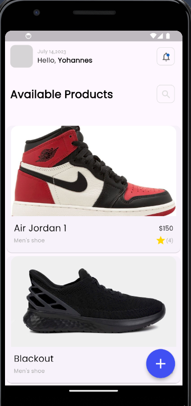
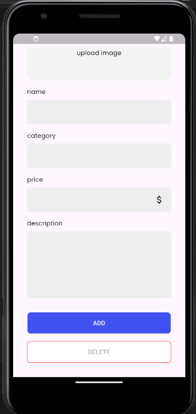

# E-commerce App Clean Architecture

This is a **clean architecture**-based e-commerce application built with Flutter. The project follows **test-driven development (TDD)** principles and adopts a scalable and maintainable architecture by ensuring a clear separation of concerns across different layers. It is designed to perform **CRUD operations** on products, allowing you to add, update, view, and delete items seamlessly.

## Table of Contents
1. [Project Overview](#project-overview)
2. [Features](#features)
   - [CRUD Operations on Product](#crud-operations-on-product)
       - [Domain Layer](#domain-layer)
       - [Data Layer](#data-layer)
       - [Presentation Layer](#presentation-layer)
   - [Authentication](#authentication)
3. [Screenshots](#screenshots)
4. [Testing](#testing)
5. [Getting Started](#getting-started)
6. [License](#license)

## Project Overview
This project demonstrates how to implement an e-commerce application using **Flutter** and **Clean Architecture** principles. It ensures the application is highly modularized and testable by keeping a distinct separation of the **Domain**, **Data**, and **Presentation** layers.

## Features
### CRUD Operations on Product
This application provides full CRUD functionality, making it easy to manage a collection of products with capabilities to add, update, delete, and view product details.

#### Domain Layer
- **Use Cases**: This layer defines the application's business logic. The available use cases include:
  - `GetAllProductsUseCase`: Fetches all products.
  - `GetProductByIdUseCase`: Retrieves a product by its ID.
  - `AddProductUseCase`: Adds a new product.
  - `UpdateProductUseCase`: Updates an existing product.
  - `DeleteProductUseCase`: Removes a product.
  
- **Entities**: The `ProductEntity` represents a product with attributes such as:
  - `id`: Unique identifier for the product.
  - `name`: Name of the product.
  - `description`: Brief description.
  - `rating`: Customer rating.
  - `price`: Price of the product.
  - `category`: Category to which the product belongs.
  - `image`: URL to the product image.

#### Data Layer
- **Models**: Handles the mapping between data and domain entities through JSON serialization and deserialization.
  - `fromJson`: Converts JSON data to a product entity.
  - `toJson`: Transforms a product entity into JSON format for storage or network transmission.

#### Presentation Layer
The presentation layer consists of Flutter UI components that communicate with the business logic using state management (such as `Bloc` or `Provider`). It includes different screens like:
- **Home Screen**: Displays a list of products.
- **Details Screen**: Shows detailed information for a selected product.
- **Add Product Screen**: Allows the user to add a new product.
- **Search Screen**: Enables searching for products.

### Authentication
The application uses **JWT (JSON Web Tokens)** for user authentication. JWT provides a secure way to handle user sessions and validate API requests. Below is an overview of the basic JWT authentication flow:

1. **User Registration/Login**: When a user registers or logs in, the backend server issues a JWT token if the credentials are valid.
2. **Token Storage**: The application securely stores this token, typically in secure storage or a local database.
3. **Authenticated API Requests**: For each subsequent request, the application includes the JWT token in the headers (usually as `Authorization: Bearer <token>`).
4. **Token Validation**: The server validates the token before executing any business logic, ensuring that the user is authenticated and authorized.

The use of JWT ensures that the application does not have to rely on session management at the server-side, making the app more scalable and secure.

## Screenshots
Here are some screenshots of the app:

- **Home Screen**  
  

- **Product Details Screen**  
  

- **Add Product Screen**  
  

- **Search Product Screen**  
  

## Testing
This project is built following **test-driven development** practices. Currently, it includes **unit tests** for:
- Domain layer use cases.
- Data layer models.

Run the tests using:

```bash
flutter test
```
## Getting Started

1. Clone the repository.
2. Run `flutter pub get` to install dependencies.
3. Use `flutter run` to start the app.
   
## License

This project is open-source and available under the MIT License.
   
